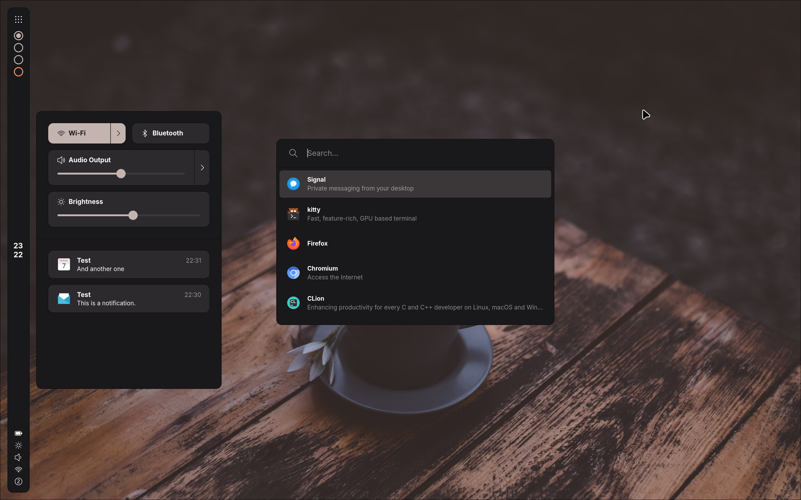

# Foobar

[](license.txt)
[](https://github.com/hannesschulze/foobar/releases)

Foobar is a bar, launcher, control center, and notification daemon I wrote for my personal desktop.

Although it was not designed to be a fully modular widget system like [ags](https://github.com/Aylur/ags) or [eww](https://github.com/elkowar/eww.git), it does offer some customization options.

| Default Configuration | A [Customized](pub/teatime.conf) Configuration |
|:---:|:---:|
|  |  |

## Features

Current features include:
- **Panel** with customizable items
	- **Icon item:** only displays an icon (duh)
	- **Clock item:** displays the current time
	- **Workspace item:** displays active workspaces (for hyprland)
	- **Status item:** displays the current status for things like battery level, brightness level, volume, network connectivity, notifications
- **Launcher**
	- Currently only supports launching applications based on `.desktop` files
- **Control Center** with two sections
	- **Controls section:** allows managing audio devices, brightness level, etc.
	- **Notifications section:** shows previous notifications
- **Notification Area** which displays incoming notifications

## Installation

### Dependencies

These dependencies must be present before building:

- `meson`
- `ninja`
- `sassc`
- `glib`
- `gtk4`
- `json-glib`
- `alsa-lib`
- `libpulseaudio`
- `libnm`
- `libwayland`
- `gobject-introspection`
- [`gtk4-layer-shell`](https://github.com/wmww/gtk4-layer-shell) (otherwise it will be built as a subproject)

In addition, these dependencies should be available at runtime:

- `upower` (for battery state)
- `brightnessctl` (for adjusting brightness level)
- `hyprland` (for listing workspaces)

### Building

To manually build foobar, run the following commands:

```sh
git clone https://github.com/hannesschulze/foobar.git && cd foobar
meson setup build --prefix=/usr
ninja -C build
```

Then, install it using the following command:

```sh
sudo ninja install -C build
```

## Usage

Please refer to the man pages that are automatically installed:

```sh
man foobar
```

## License

This project is licensed under the MIT License - see the [license.txt](license.txt) file for details.
